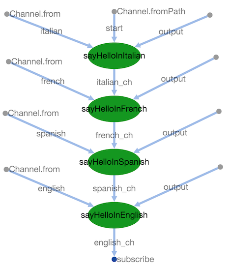

Hello World Pipeline
====================
[](https://www.nextflow.io/)

A simple script showing the basic Hello World! example for the Nextflow pipeline. 
# Description
4 processes, each of them append a line to a file consumed by the next process.
At the end of the execution, the content of the final file is shown.

# Execution
Clone the project and run:

    nextflow run main.nf -profile local/sge 

or with [pipeline sharing](https://www.nextflow.io/docs/latest/en/latest/sharing.html), just run:
    
    nextflow run eipm/hello-nextflow 
    
# Output
    
``` bash
$ nextflow run eipm/hello-nextflow 
N E X T F L O W  ~  version 20.01.0
Pulling eipm/hello-nextflow ...
downloaded from https://github.com/eipm/hello-nextflow.git
Launching `eipm/hello-nextflow` [nauseous_austin] - revision: 83ede5f13c [master]
executor >  local (4)
[ad/53a790] process > sayHelloInItalian [100%] 1 of 1 ✔
[c0/0a38d8] process > sayHelloInFrench  [100%] 1 of 1 ✔
[2a/ffd88f] process > sayHelloInSpanish [100%] 1 of 1 ✔
[8a/2d40fc] process > sayHelloInEnglish [100%] 1 of 1 ✔
EIPM says:
Ciao world!
Bonjour world!
Hola world!
Hello world!
```    
## DAG visualization
